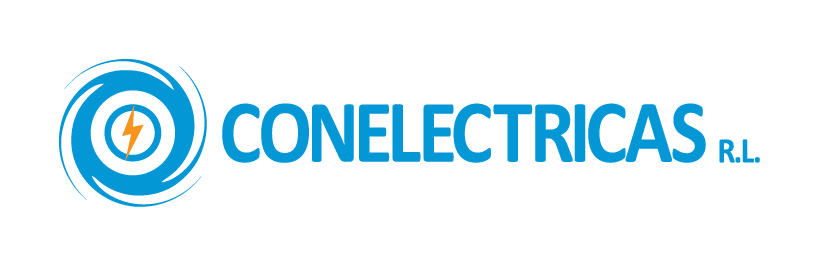

# Conelectricas R.L.

Plataforma interna de aplicaciones para la gestión de los diferentes departamentos de Conelectricas R.L.  
Desarrollamos y mantenemos soluciones para:

- 🌐 **CONELEC-APPS** – Sistema integrado web para RRHH, SySO, flota vehicular, contabilidad, etc.
- ⚡ **STE** – Sistema de Transacciones de Excedentes de Energía.
- 💡 **GENELECTRIC** – Módulos de generación eléctrica y gestión de mediciones.

## Tecnologías principales

- **Frontend:** Angular, TypeScript, SCSS  
- **Backend:** Node.js, Express, Sequelize  
- **Infraestructura:** Docker, Vercel / servidores propios  

> Repositorios de código: acceso privado para el equipo interno y socios tecnológicos.

## Sistemas principales

  
  &nbsp;&nbsp;&nbsp;&nbsp;&nbsp;
  

  <strong>CONELECTRICAS R.L.</strong> – Plataforma corporativa 
  <strong>STE</strong> – Sistema de Transacciones de Excedentes de Energía

